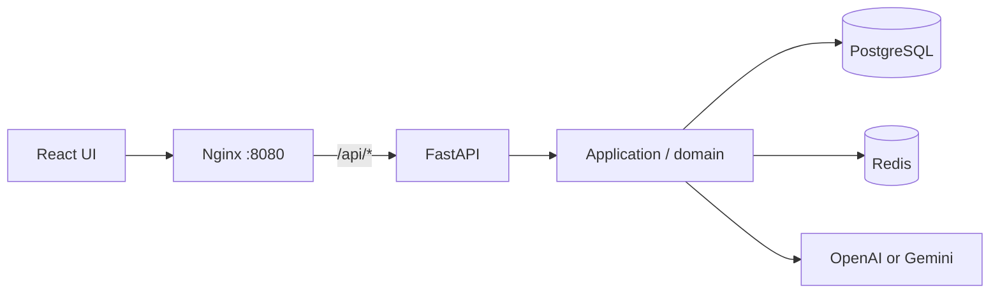
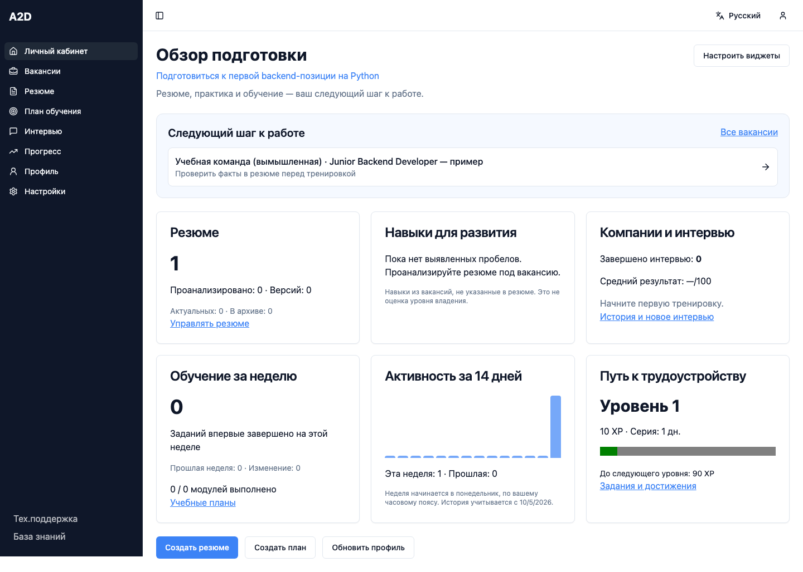

# A2D Career Studio

A vacancy-centred career preparation MVP for early-career IT candidates. Connect confirmed profile facts, a tailored resume, interview practice and a learning plan around one saved job opportunity. Evolved from the GDG AITU hackathon CareerBot.

[Product decisions and market context](docs/product.md) · [Five-minute demo](docs/demo.md) · [Operating notes](docs/operations.md)

[](https://github.com/DaniyarAbikenov/gdg-aitu-hackhathon/actions/workflows/ci.yml)

## One repository, one application

The original React frontend from [`skill-pathfinder-151`](https://github.com/DaniyarAbikenov/skill-pathfinder-151) lives in **`frontend/`**. Its Tailwind/shadcn design, navigation and section editors are retained. [Source provenance](frontend/UPSTREAM.md) records the imported commit. The original repository remains available for historical reference.

| Directory | Responsibility |
|---|---|
| `frontend/` | React, TypeScript, Vite, original UI and typed API adapters |
| `app/domain/` | Framework-independent business models |
| `app/application/` | Use cases and repository/service ports |
| `app/infrastructure/` | PostgreSQL, Redis, OpenAI/Gemini, PDF and identity adapters |
| `app/presentation/` | FastAPI endpoints and HTTP validation |
| `app/contracts.py` | Validated value contracts shared by HTTP and document adapters |
| `migrations/` | Alembic schema migrations |
| `tests/` | Integration, provider-contract and desktop/mobile browser tests |

## Run

```bash
git clone --branch codex/portfolio-careerbot https://github.com/DaniyarAbikenov/gdg-aitu-hackhathon.git
cd gdg-aitu-hackhathon
cp .env.example .env
docker compose up --build --wait
```

Open **http://localhost:8080**. Set `CAREER_PORT=8088` in `.env` for another port.

Compose starts React/Nginx, FastAPI, PostgreSQL 17, Redis 7.4 and the migration job. Only Nginx is exposed, on loopback. Frontend routes and `/api/*` share one origin and an HttpOnly session cookie. Database volumes survive rebuilds; **`docker compose down --volumes` deletes them**.



### AI configuration

**The default is `CAREER_PROVIDER=unconfigured`.** Accounts, profiles, manual resume creation/editing, versions and PDF/DOCX exports work without cloud credentials. Importing documents and composing with AI require a configured provider. AI generation reports that configuration is required; it does not return demo results.

For real AI extraction, adaptation, interview questions/evaluation and learning plans, set these values locally:

```dotenv
CAREER_PROVIDER=openai
CAREER_OPENAI_API_KEY=your-key
CAREER_OPENAI_MODEL=your-supported-model-id
CAREER_GOOGLE_CLIENT_ID=
```

Choose an OpenAI model available to your API account that supports Responses structured outputs and image/PDF input. The adapter uses the [Responses structured-output format](https://developers.openai.com/api/docs/guides/structured-outputs) and [PDF file inputs](https://developers.openai.com/api/docs/guides/file-inputs), with `store=false`. This flag does not override the provider’s retention policies. Refusals, incomplete outputs and API errors fail explicitly; there is no automatic provider fallback.

To switch back to Gemini, set `CAREER_PROVIDER=gemini`, `CAREER_GEMINI_API_KEY` and `CAREER_GEMINI_MODEL`. Authentication is independent of this selection.

Then run `docker compose up --build --wait`. Never commit `.env`. The selected provider receives uploaded documents and the relevant profile, vacancy or interview data. Responses are validated, and proposed resume changes require review. Live provider calls require your credentials; CI uses HTTP contract fixtures and explicitly selects `local` only for deterministic browser tests. `local` is a labelled test mode with templates, not AI.

Google login separately requires `CAREER_GOOGLE_CLIENT_ID` and an authorized web origin in Google Cloud. Email/password registration and login use PostgreSQL accounts and Redis sessions, and work independently without Google credentials. Leave `CAREER_GOOGLE_CLIENT_ID` empty to use only email/password; the Google button is hidden. Set it to enable Google alongside email/password. No accounts or saved data are deleted when changing providers. Passwords need at least 12 characters. Google ID tokens are verified server-side, with a single-use Redis nonce. Existing Firebase accounts are not automatically migrated.



Screenshots use a fictional account in the explicitly labelled test environment: [resume editor](docs/screenshots/resume.png), [interview](docs/screenshots/interview.png), [plan](docs/screenshots/plan.png).

## Workflows

- Register, log in, edit a profile, save language, and log out without losing data. Export private records, change a password (revoking old sessions), or delete a password account with confirmation.
- Save vacancies, track application stages and next-contact dates, and reuse the same context across resume, interview and learning workflows. No messages or applications are sent automatically.
- Upload or drag-and-drop PDF (up to 5 MiB/20 pages), DOCX or TXT, review extracted fields and edit experience, education and projects as structured entries. The API also accepts UTF-8 text files. Original upload bytes are not retained.
- Adapt to a vacancy with OpenAI or Gemini; inspect before/after proposals, accept selected changes into saved versions, compare snapshots, restore and download PDFs in three styles.
- Start an interview, receive coaching, reload or resume a saved session from history, and review scores and reference answers. Scores describe practice performance, not hiring suitability.
- Generate an eight-week plan from a career goal or interview feedback, persist completed modules and export the plan. NotebookLM uses a text download and manual external import.
- View real progress and claim milestones backed by saved data.
- Dictation uses the browser speech API when supported; its provider may process audio. Typed input is always available.

The original core UI is localized in English, Russian and Kazakh; some helper copy is Russian. Support contacts and notification delivery were unfinished in the prototype and are not represented as functioning services. Password recovery and email verification are not implemented.

## Persistence and concurrency

PostgreSQL stores accounts, profiles, resumes, versions, interviews, plans and rewards. JSONB preserves structured sections and supports legacy text records. Redis stores sessions and shared rate limits. There is no SQLite or process-local data cache. React/Zustand hold transient form state only; persisted records are reloaded from the API.

Updates include revisions to reject stale writes. Passwords use salted scrypt. Guest records expire; registered account records remain until deleted. The backend enforces ownership on every record lookup.

## Development and CI

```bash
npm ci --prefix frontend
npm run typecheck --prefix frontend
npm run lint --prefix frontend
npm run build --prefix frontend

# Hot reload frontend, forwarding /api to the Docker gateway on port 8080:
npm run dev --prefix frontend

# Real PostgreSQL/Redis integration suite in isolated containers:
docker compose -p career-tests -f compose.test.yml up --build --abort-on-container-exit --exit-code-from tests
docker compose -p career-tests -f compose.test.yml down --volumes

# Browser tests against a disposable stack with an explicitly selected test provider:
CAREER_PROVIDER=local CAREER_PORT=8091 CAREER_SESSION_CREATIONS_PER_HOUR=100 CAREER_AUTH_PER_15_MINUTES=100 CAREER_ADMIN_EMAILS=admin-e2e@example.test docker compose -p career-browser up --build --wait
printf '%s\n' 'Portfolio-test-password-42' | docker compose -p career-browser exec -T backend python -m app.manage admin-e2e@example.test --password-stdin
npm ci
npx playwright install chromium
BASE_URL=http://127.0.0.1:8091 npm run test:e2e
```

The isolated browser stack raises auth attempts to 100 per 15 minutes and session creation to 100 per hour because all browser accounts share one test IP; the default runtime limits remain 15 auth attempts per 15 minutes and 30 new sessions per hour.

GitHub Actions validates frontend types/lint/build/runtime dependency audit, Python lint/format/migrations/tests/coverage/audit, and a complete Docker stack with desktop/mobile browser journeys. The integration suite refuses to truncate a database not named `career_test`.

The home page explains the product before sign-in. Run `python3 scripts/seed_demo.py --url http://localhost:8080` to create a separate fictional presentation account with manual profile/vacancy/resume data and no invented AI results.

API schema: **http://localhost:8080/api/openapi.json**. Swagger: **http://localhost:8080/api/docs**.

Noto Sans is bundled under the [SIL Open Font License](app/assets/OFL.txt). No license is inferred for the original project.

### Shared skill catalog

The profile skill picker searches a shared PostgreSQL catalog and displays descriptions contributed by users. Authenticated users can add a missing skill with an optional description of up to 1000 characters. Existing descriptions are preserved when a duplicate name is submitted. Creation is limited to 30 requests/hour per account in Redis, independently of AI limits.

Names are normalized with Unicode NFKC, collapsed whitespace and case folding: `CSS`, `css` and `ＣＳＳ` share one unique identity. Punctuation remains meaningful (`C`, `C++` and `C#` stay distinct). PostgreSQL `pg_trgm` provides indexed fuzzy suggestions; users choose whether a similar name is the intended skill. Similarity alone never silently merges different technologies. Migration `0004` installs `pg_trgm` and seeds eight common skills; managed databases must permit that extension.

API: authenticated `GET /skills?q=...` returns up to 15 matches; `POST /skills` accepts `name` and an optional `description` and returns the existing or newly created canonical skill. Through Docker, use the `/api` prefix.

## Product workflows and administration

- **Overview:** six removable account-saved widgets: resume counts/assessments, vacancy skill gaps, practiced companies/interviews, weekly learning, 14-day activity and progression. Calendar weeks start Monday using the browser UTC offset. Historical actions are not fabricated; tracking starts when events are first recorded.
- **Profile → resume:** structured experience (role, dates, location, responsibilities, achievements), education, projects, contacts, certificates and languages. `/resume/new` lets users select profile sections and a target role/vacancy. AI asks clarification questions when facts are insufficient; users can also assemble manually. Creation snapshots profile facts without overwriting existing resumes.
- **Library:** title, original filename, description, draft/active/archived status, search, version comparison/restore and PDF/DOCX export. Word means `.docx`, not legacy `.doc`. Uploaded bytes are not retained. AI extraction errors never silently fall back to heuristic parsing; the deterministic parser remains limited to explicit test mode.
- **Learning:** position and multiple preferred technologies are supplied to generation; module evidence can be saved. XP is awarded once per durable action identity, so toggling the same module repeatedly does not earn additional XP. Levels measure preparation activity, not employability.
- **Interview:** saved private companies/vacancies, catalog-based technology selection, theory/practice multi-selection, resumable history and answer-level feedback. Dictation lives on the interview page. Settings contains account/language controls rather than professional profile or microphone options.
- **Knowledge:** searchable published articles, categories, article deep links, related reading and an administrator editor with draft/preview/publish/unpublish, optimistic revision protection, and server-side access enforcement. Article text is rendered without executing HTML.

### Administrator provisioning

Set `CAREER_ADMIN_EMAILS=admin@a2d.local` (comma-separated for multiple operators), recreate the backend, then provision the account locally:

```sh
docker compose exec backend python -m app.manage admin@a2d.local
```

The command prompts for a password; an existing password is never overwritten. Allowlisted administrator addresses cannot be registered through the public registration endpoint. Never put bootstrap passwords in source control. The editor is at `/admin/knowledge`, also linked from Settings for administrators.

### Live voice interviews

Set `CAREER_OPENAI_API_KEY`, `CAREER_OPENAI_REALTIME_MODEL` and `CAREER_OPENAI_TRANSCRIPTION_MODEL` to models available to your API project. Keep `CAREER_PROVIDER=openai` and a structured-output-capable `CAREER_OPENAI_MODEL` for the final evaluation. The backend uses the [official Realtime WebRTC unified interface](https://developers.openai.com/api/docs/guides/voice-webrtc): server-authenticated `/v1/realtime/calls` signalling, browser WebRTC media/data channel, automatic turn detection and interruptions. Browser clients never receive the ordinary API key. Use HTTPS in deployments; localhost is permitted by browsers for microphone testing.

Completed user and assistant transcripts are saved with revision checks in PostgreSQL and displayed in interview history. No audio blobs are saved by this application. Provider retention rules still apply. Pause/end/unmount closes local tracks and requests call termination. Reconnect restores the saved conversational context. Failed transcript writes remain visible and can be retried; leaving before retrying can lose unsaved browser-held turns. Voice assessment is server-generated from the supplied transcript, which is practice data, not proctored evidence.

Live voice and cloud extraction quality must be checked with real account credentials and representative user documents. CI validates request/response contracts and explicit failures without making paid provider calls. `CAREER_ENVIRONMENT=production` hides global technical status banners; actionable errors remain next to the failed operation. Explicit `local` mode remains clearly labelled as a test provider.
