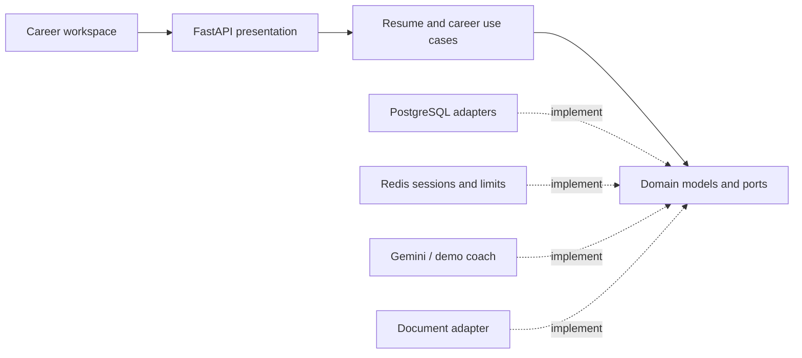

# CareerBot

**A connected career preparation workspace:** build a profile, adapt a resume to a role, practice an interview, turn feedback into a learning plan, and track your progress.

This project began at the GDG AITU hackathon. The refactor preserves the original career-assistant concept and completes previously mocked workflows using PostgreSQL, Redis and a layered FastAPI application.

[](https://github.com/DaniyarAbikenov/gdg-aitu-hackhathon/actions/workflows/ci.yml)


## Run locally

```bash
git clone https://github.com/DaniyarAbikenov/gdg-aitu-hackhathon.git
cd gdg-aitu-hackhathon
docker compose up --build --wait
```

Open **http://localhost:8080**. Use `CAREER_PORT=8088` if that port is occupied. Compose starts PostgreSQL 17, Redis 7.4, Alembic migrations and the application. Only the application is exposed, on the loopback interface.

### Explore the full journey

1. **Profile & goal:** save your actual experience, skills, education, projects, certificates, contact details, target role and career goal.
2. **Resume:** upload PDF/TXT or try the fictional sample. Check the extracted fields, compare a job description, review proposed before/after changes, and accept the changes you want into a saved version.
3. **Versions:** inspect differences, restore a version as the current resume, or download it. PDF export supports modern, classic and minimalist styles.
4. **Interview:** choose company, role, stack, style and coaching language. Submit answers one at a time. Review the feedback, reference answers and final practice score. Resume an unfinished session from history.
5. **Learning plan:** generate an eight-week plan using your goal, selected resume gaps and interview feedback. Complete exercises, save evidence, and export the plan.
6. **Progress:** see real completion counts, interview practice scores, saved resume versions and earned milestones.
7. **Account:** register to retain the guest workspace, or sign in to an existing account from another browser. Signing out preserves account data.

See the [original-to-current feature map](docs/features.md) and [API migration notes](docs/migration.md).

## Real coaching and the credential-free demo

The application has two explicit modes. **Demo mode is not a replacement for the AI features.**

| Capability | `CAREER_PROVIDER=local` | `CAREER_PROVIDER=gemini` |
|---|---|---|
| Resume extraction | Heuristic extraction from text PDFs/TXT | Gemini extracts fields from PDF (including readable scans) or text |
| Job review | Vocabulary matching and deterministic suggestions | Matching plus structured Gemini recommendations |
| Before/after adaptation | Reorders existing skills or reuses a confirmed profile introduction | Personalized rewrites grounded in resume/profile facts |
| Interview | Contextual templates and an explicit keyword rubric | Generated questions and answer evaluation |
| Learning plan | Eight-week curriculum template using recorded gaps | Personalized eight-week plan from profile and feedback |

Demo interview scores count criterion words; they do not assess technical correctness. No mode claims an ATS score or predicts hiring outcomes. AI suggestions need human review and are never automatically applied to a resume.

### Enable Gemini

Copy `.env.example` to `.env`, set `CAREER_PROVIDER=gemini`, and supply `CAREER_GEMINI_API_KEY` and a supported `CAREER_GEMINI_MODEL`. Recreate the application:

```bash
docker compose up --build --wait
```

In Gemini mode, uploads are sent to Google for extraction; coaching sends the relevant fields, goals and answers. The interface discloses this before use. PDF rendering stays local. Responses are validated against bounded schemas; provider failures are recoverable and do not overwrite saved work. Live calls require your credentials and are not made by CI. Contract tests exercise extraction, rewriting, questions, evaluation, plans and provider failures with mocked HTTP responses.

### Enable Google sign-in

Set `CAREER_GOOGLE_CLIENT_ID` to a Google Identity Services web client ID and configure the application's origin in Google Cloud. The button appears on the Account screen. The server uses Google's token verifier to validate signature, issuer, audience and expiration, and checks a single-use nonce stored in Redis. Password accounts are never silently linked by matching email. No client secret or Google password is collected by the application.

See [Google's ID token verification documentation](https://developers.google.com/identity/gsi/web/guides/verify-google-id-token).

## Architecture



- **Domain/application:** framework-independent models, ports, ownership-aware workflows and revision checks.
- **Infrastructure:** PostgreSQL repositories, Redis, document extraction/PDF rendering, password hashing, Google identity verification and Gemini contracts.
- **Presentation:** validated HTTP contracts and responsive UI. The composition root wires dependencies.
- **Storage:** separate PostgreSQL tables for accounts, profiles, resumes, versions, interviews, plans and rewards. Aggregate documents use JSONB with explicit ownership, revision and expiration columns.
- **Concurrency:** optimistic revision checks prevent stale writes, including after slow AI requests. Shared rate limits live in Redis.

There is no SQLite database, fake persistence layer or process-local data cache. See [architecture decisions](docs/architecture.md).

## Data lifecycle and boundaries

- Guest sessions and their records expire after 24 hours by default; a periodic job removes expired records within five minutes while the server runs.
- Registering preserves the current guest records as account-owned data. Account records do not expire when a login session ends. Email/password accounts use salted scrypt hashes; session tokens are opaque, HttpOnly and stored under hashed Redis keys.
- Clear workspace deletes the user's saved career data and ends the session. The account credential remains available for future sign-in. Individual resume deletion also removes its saved versions.
- Uploads: PDF/TXT, up to 2 MB and 20 PDF pages by default. Demo extraction needs readable text; Gemini extraction can process scans. Original uploads are not retained.
- Resumes: up to 20 per workspace. Other aggregate types: up to 100 of each kind. Redis limits new sessions, authentication attempts and coaching requests.
- English, Russian and Kazakh preferences are persisted. Navigation and core form controls are localized; some explanatory copy remains English. Gemini is instructed to use the coaching language; demo coaching is English.
- Optional dictation uses the browser speech API, with explicit disclosure. Browser support varies; typed answers always work.
- NotebookLM integration is a real text export plus an external link for manual import. CareerBot does not claim to generate video/audio overviews itself.

The Docker configuration targets local portfolio evaluation. Public hosting additionally needs HTTPS, secure cookies, infrastructure credentials, backups and operational monitoring. Password recovery/email verification and migration of legacy cloud accounts/data are not included.

## Development and verification

```bash
# Real PostgreSQL/Redis integration tests in isolated containers
docker compose -p career-tests -f compose.test.yml up --build --abort-on-container-exit --exit-code-from tests
docker compose -p career-tests -f compose.test.yml down --volumes

# Python 3.12 lint and schema checks
python3.12 -m venv .venv
source .venv/bin/activate
pip install -r requirements-dev.txt
ruff check app tests migrations
ruff format --check app tests migrations

# Browser checks against the running app
npm ci
npx playwright install chromium
npm run format:check
npm run test:e2e
# BASE_URL=http://127.0.0.1:8088 npm run test:e2e
```

The integration suite refuses to truncate a database not named `career_test`. CI checks architecture boundaries, formatting, migrations/schema drift, tests with an 85% coverage gate, dependency vulnerabilities, Docker startup and desktop/mobile browser journeys. API docs are at **http://localhost:8080/docs**.

## Project history

The initial prototype used Firebase, Firestore, GCS and Vertex/Gemini, with a separate frontend in `skill-pathfinder-151`. The portfolio branch supplies a same-origin UI and explicit migration notes. It does not modify the external frontend repository or deployed Google Cloud services. Original code remains in Git history.

Noto Sans is bundled under the [SIL Open Font License](app/assets/OFL.txt). No license is inferred for the original project.
