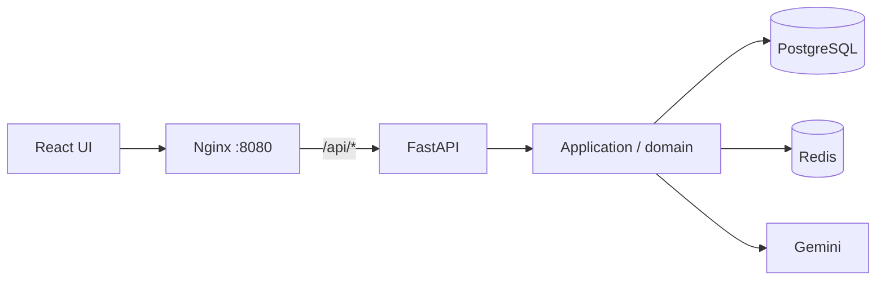

# CareerBot

A career preparation application from the GDG AITU hackathon: profile → resume adaptation → interview practice → learning plan → progress.

[](https://github.com/DaniyarAbikenov/gdg-aitu-hackhathon/actions/workflows/ci.yml)

## One repository, one application

The original React frontend from [`skill-pathfinder-151`](https://github.com/DaniyarAbikenov/skill-pathfinder-151) lives in **`frontend/`**. Its Tailwind/shadcn design, navigation and section editors are retained. [Source provenance](frontend/UPSTREAM.md) records the imported commit. The original repository remains available for historical reference.

| Directory | Responsibility |
|---|---|
| `frontend/` | React, TypeScript, Vite, original UI and typed API adapters |
| `app/domain/` | Framework-independent business models |
| `app/application/` | Use cases and repository/service ports |
| `app/infrastructure/` | PostgreSQL, Redis, Gemini, PDF and identity adapters |
| `app/presentation/` | FastAPI endpoints and HTTP validation |
| `app/contracts.py` | Validated value contracts shared by HTTP and document adapters |
| `migrations/` | Alembic schema migrations |
| `tests/` | Integration, provider-contract and desktop/mobile browser tests |

## Run

```bash
git clone --branch codex/portfolio-careerbot https://github.com/DaniyarAbikenov/gdg-aitu-hackhathon.git
cd gdg-aitu-hackhathon
cp .env.example .env
docker compose up --build --wait
```

Open **http://localhost:8080**. Set `CAREER_PORT=8088` in `.env` for another port.

Compose starts React/Nginx, FastAPI, PostgreSQL 17, Redis 7.4 and the migration job. Only Nginx is exposed, on loopback. Frontend routes and `/api/*` share one origin and an HttpOnly session cookie. Database volumes survive rebuilds; **`docker compose down --volumes` deletes them**.



### AI configuration

**The default is `CAREER_PROVIDER=unconfigured`.** Accounts, profiles, text-based resume extraction, manual editing, versions and PDF exports work without cloud credentials. AI generation reports that configuration is required; it does not return demo results.

For real AI extraction, adaptation, interview questions/evaluation and learning plans, set these values locally:

```dotenv
CAREER_PROVIDER=gemini
CAREER_GEMINI_API_KEY=your-key
CAREER_GEMINI_MODEL=your-supported-model-id
```

Then run `docker compose up --build --wait`. Never commit `.env`. Gemini receives uploaded documents and the relevant profile, vacancy or interview data. Responses are validated, and proposed resume changes require review. Live provider calls require your credentials; CI uses HTTP contract fixtures and explicitly selects `local` only for deterministic browser tests. `local` is a labelled test mode with templates, not AI.

Google login separately requires `CAREER_GOOGLE_CLIENT_ID` and an authorized web origin in Google Cloud. Email/password login works independently. Passwords need at least 12 characters. Google ID tokens are verified server-side, with a single-use Redis nonce. Existing Firebase accounts are not automatically migrated.


Screenshots use a fictional account in the explicitly labelled test environment: [resume editor](docs/screenshots/resume.png), [interview](docs/screenshots/interview.png), [plan](docs/screenshots/plan.png).

## Workflows

- Register, log in, edit a profile, save language and dictation preferences, and log out without losing data.
- Upload a PDF (up to 5 MiB/20 pages), review extracted fields and edit experience, education and projects as structured entries. The API also accepts UTF-8 text files. Original upload bytes are not retained.
- Adapt to a vacancy with Gemini; inspect before/after proposals, accept selected changes into saved versions, compare snapshots, restore and download PDFs in three styles.
- Start an interview, receive coaching, reload or resume a saved session from history, and review scores and reference answers. Scores describe practice performance, not hiring suitability.
- Generate an eight-week plan from a career goal or interview feedback, persist completed modules and export the plan. NotebookLM uses a text download and manual external import.
- View real progress and claim milestones backed by saved data.
- Dictation uses the browser speech API when supported; its provider may process audio. Typed input is always available.

The original core UI is localized in English, Russian and Kazakh; some helper copy is Russian. Support contacts and notification delivery were unfinished in the prototype and are not represented as functioning services. Password recovery and email verification are not implemented.

## Persistence and concurrency

PostgreSQL stores accounts, profiles, resumes, versions, interviews, plans and rewards. JSONB preserves structured sections and supports legacy text records. Redis stores sessions and shared rate limits. There is no SQLite or process-local data cache. React/Zustand hold transient form state only; persisted records are reloaded from the API.

Updates include revisions to reject stale writes. Passwords use salted scrypt. Guest records expire; registered account records remain until deleted. The backend enforces ownership on every record lookup.

## Development and CI

```bash
npm ci --prefix frontend
npm run typecheck --prefix frontend
npm run lint --prefix frontend
npm run build --prefix frontend

# Hot reload frontend, forwarding /api to the Docker gateway on port 8080:
npm run dev --prefix frontend

# Real PostgreSQL/Redis integration suite in isolated containers:
docker compose -p career-tests -f compose.test.yml up --build --abort-on-container-exit --exit-code-from tests
docker compose -p career-tests -f compose.test.yml down --volumes

# Browser tests against a disposable stack with an explicitly selected test provider:
CAREER_PROVIDER=local CAREER_PORT=8091 docker compose -p career-browser up --build --wait
npm ci
npx playwright install chromium
BASE_URL=http://127.0.0.1:8091 npm run test:e2e
```

GitHub Actions validates frontend types/lint/build/runtime dependency audit, Python lint/format/migrations/tests/coverage/audit, and a complete Docker stack with desktop/mobile browser journeys. The integration suite refuses to truncate a database not named `career_test`.

API schema: **http://localhost:8080/api/openapi.json**. Swagger: **http://localhost:8080/api/docs**.

Noto Sans is bundled under the [SIL Open Font License](app/assets/OFL.txt). No license is inferred for the original project.
