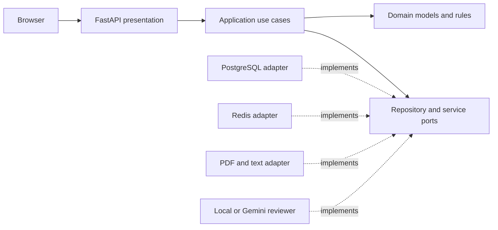

# Career Studio

A resume workshop built from a GDG AITU hackathon prototype. Upload a resume, verify the extracted details, compare it with a job description, and download a clean PDF containing only facts you have reviewed.

[](https://github.com/DaniyarAbikenov/gdg-aitu-hackhathon/actions/workflows/ci.yml)


## Try it in two minutes

Requires Docker with Compose v2. The default reviewer makes **no external AI calls**.

```bash
git clone https://github.com/DaniyarAbikenov/gdg-aitu-hackhathon.git
cd gdg-aitu-hackhathon
docker compose up --build --wait
```

Open **http://localhost:8080**, select **Try a sample resume**, then **Find my focus**. Edit a field and download the PDF. A fictional example is included so you can explore without uploading personal data.

Compose starts PostgreSQL, Redis, a one-shot Alembic migration, and the FastAPI application. Only the application is exposed, on the loopback interface. Set `CAREER_PORT=8088` if port 8080 is occupied.

## What the project demonstrates

- **A complete user journey:** PDF/TXT upload → editable fields → job comparison → factual PDF export.
- **Clean Architecture:** framework-independent domain and use cases; adapters for PostgreSQL, Redis, documents, and Gemini.
- **Reliable state:** owner-scoped records, expiring Redis sessions, optimistic concurrency, and invalidated recommendations after edits.
- **Useful failure handling:** malformed or scanned PDFs, oversized uploads, stale tabs, unavailable providers, and expired sessions.
- **Reproducibility:** pinned dependencies, Alembic migrations, Docker health checks, real database integration tests, and desktop/mobile browser tests.

The default review is an explicit keyword-based baseline. It compares a documented vocabulary, identifies gaps, and suggests clearer evidence. It is **not an ATS score, a hiring prediction, or a claim of semantic understanding**. An optional Gemini adapter adds structured writing recommendations.

## Scope and tradeoffs

This release completes the resume workflow. The original Firebase/Vertex-based prototype included unfinished interview, profile, and roadmap modules. Those modules were removed from the runnable application rather than advertised as completed features. Their history remains in Git. See [migration notes](docs/migration.md).

The original separate frontend, `skill-pathfinder-151`, is not required and has not been changed. This repository includes a small same-origin interface to make the complete backend use case easy to run and evaluate.

## Architecture



| Layer | Responsibility |
|---|---|
| `app/domain` | Plain Python models, skill matching, errors; no framework imports |
| `app/application` | Use cases and ports; no database or HTTP client imports |
| `app/infrastructure` | SQLAlchemy/PostgreSQL, Redis, PDF handling, Gemini HTTP adapter |
| `app/presentation` | FastAPI routes, Pydantic contracts, HTTP policies |
| `app/main.py` | Composition root and resource lifecycle |

PostgreSQL stores resume aggregates with JSONB fields, explicit ownership, revision, and expiration columns. Redis holds session tokens as hashed keys and atomic rate-limit counters. There are no SQLite databases or process-local data caches. See [architecture decisions](docs/architecture.md).

## Development and tests

Run the integration suite against its own real PostgreSQL and Redis containers:

```bash
docker compose -p career-tests -f compose.test.yml up --build --abort-on-container-exit --exit-code-from tests
docker compose -p career-tests -f compose.test.yml down --volumes
```

The test database must be named `career_test`; the suite refuses to truncate any other database. No SQLite, fake Redis, or in-memory repository is substituted.

For local linting with Python 3.12:

```bash
python3.12 -m venv .venv
source .venv/bin/activate
pip install -r requirements-dev.txt
ruff check app tests migrations
ruff format --check app tests migrations
```

Browser tests run against the application started by Compose:

```bash
npm ci
npx playwright install chromium
npm run test:e2e
# Or: BASE_URL=http://127.0.0.1:8088 npm run test:e2e
```

GitHub Actions runs lint, architecture checks, migration checks, integration tests with an 85% coverage gate, dependency auditing, Docker startup, and the full browser workflow on desktop and mobile.

## Optional Gemini reviewer

Copy `.env.example` to `.env`, set `CAREER_PROVIDER=gemini`, and supply `CAREER_GEMINI_API_KEY` and a supported `CAREER_GEMINI_MODEL` ID. Restart with `docker compose up --build --wait`.

The interface discloses that reviewed resume fields and the job description are sent to Google when analysis is requested. Upload extraction and PDF rendering stay local. Provider responses must satisfy a bounded schema; failures return a recoverable error. Model-generated HTML is never executed. Live Gemini calls require your credentials and are not part of CI; HTTP contract and failure paths are tested with a mocked external transport.

## API

Interactive docs: **http://localhost:8080/docs**.

1. `POST /api/session` creates an HttpOnly, SameSite=Strict workspace cookie.
2. `POST /resume/upload` accepts multipart `file` and returns editable fields plus a revision.
3. `POST /resume/{id}/save` accepts `{fields, revision}`.
4. `POST /resume/{id}/improve` accepts `{jd_text, revision}`.
5. `GET /resume/{id}/pdf` returns an actual PDF.
6. `DELETE /resume/{id}` deletes a resume; `DELETE /api/session` clears the whole workspace.

GET endpoints never call AI or change resume state. Concurrent edits return 409 instead of overwriting another tab. Repeated analysis of the unchanged saved resume and same job reuses the persisted result.

## Data and limits

- UTF-8 TXT and text-based PDF, 2 MB, 20 pages, and 30,000 extracted characters by default.
- Image-only/scanned PDFs need OCR before upload. Extraction is heuristic; review all fields.
- Up to 20 resumes per session and 30 new analyses per hour. Rate limits live in Redis.
- Sessions expire after 24 hours by default. Expired resumes are immediately inaccessible and purged by a periodic job within five minutes while the application runs.
- Only extracted fields are saved; original uploads are not retained. Use the delete controls to remove records immediately.
- This is a local portfolio demo. Before hosting publicly, add HTTPS, secure cookies, appropriate authentication, infrastructure credentials, backups and operational monitoring. The browser workspace is not a full user-account system.

## Project background

The original hackathon explored a career assistant using FastAPI and Google Cloud. The portfolio refactor focuses on a small, demonstrable use case and makes architectural decisions and limitations explicit. The implementation history is preserved in Git.

Bundled Noto Sans is distributed under the SIL Open Font License; see [font license](app/assets/OFL.txt). No license is inferred for the original project.
