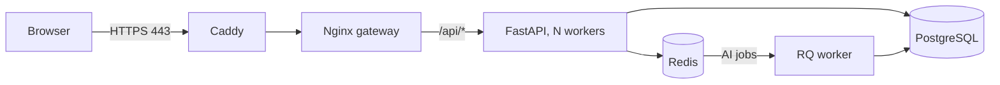

# Deploying a public demo

The repository ships everything needed to run Career Studio on one small Linux server (2 vCPU, 2 GB RAM is enough for a demo): images published to GitHub Container Registry, a production Compose overlay and a Caddy reverse proxy that obtains HTTPS certificates automatically.



Only Caddy is reachable from the internet. Nginx is bound to the server's loopback address; the API, PostgreSQL and Redis stay on the internal Compose network.

## 1. Publish images

Images are built by `.github/workflows/release.yml` when a version tag is pushed:

```sh
git tag v0.5.0
git push origin v0.5.0
```

The workflow pushes `ghcr.io/<owner>/career-studio-backend:0.5.0` and `career-studio-frontend:0.5.0` (plus `latest`), then starts both images with the production overlay and checks `/health`. Packages are private by default; make them public in the GitHub package settings, or run `docker login ghcr.io` on the server with a token that has `read:packages`.

## 2. Prepare the server

1. Point a DNS `A`/`AAAA` record for your domain at the server and open ports 80 and 443.
2. Install Docker Engine with the Compose plugin (v2.24 or newer).
3. Clone the repository (the server needs the Compose files, not the source):

   ```sh
   git clone https://github.com/DaniyarAbikenov/gdg-aitu-hackhathon.git career-studio
   cd career-studio
   cp deploy/env.example deploy/.env
   chmod 600 deploy/.env
   ```

4. Fill in `deploy/.env`: the domain, the released `CAREER_VERSION` and a generated `CAREER_DB_PASSWORD` (`openssl rand -base64 32`). `deploy/.env` is ignored by Git; never commit it.

## 3. Start

```sh
docker compose -f docker-compose.yml -f deploy/compose.prod.yml --env-file deploy/.env up -d --wait
```

Caddy requests a certificate on the first request to the domain. The overlay forces `CAREER_SECURE_COOKIE=true`, so sign-in only works over HTTPS.

Check the deployment:

```sh
curl --fail https://$CAREER_DOMAIN/health
docker compose -f docker-compose.yml -f deploy/compose.prod.yml --env-file deploy/.env exec backend alembic check
```

## 4. Demo account

The demo uses `CAREER_PROVIDER=local`, the rule-based provider. The UI labels it as a test provider, so no AI result is presented as real. The gateway is also published on the server's loopback address, so a separate fictional account can be seeded on the server itself:

```sh
python3 scripts/seed_demo.py --url http://127.0.0.1:8080
```

The script asks for the demo password at a hidden prompt, never overwrites an existing account and makes no AI calls. Share the password in the portfolio description only if the account is meant to be public.

Guests can also use the app without an account: a browser session gets its own private workspace that expires after `CAREER_SESSION_HOURS`.

To show real AI features, set `CAREER_PROVIDER=openai` (or `gemini`) with your own key and model, set a spending limit at the provider, keep `CAREER_ANALYSIS_PER_HOUR` low and restart the backend.

## 5. Update

```sh
sed -i 's/^CAREER_VERSION=.*/CAREER_VERSION=0.5.1/' deploy/.env
docker compose -f docker-compose.yml -f deploy/compose.prod.yml --env-file deploy/.env up -d --wait
```

The `migrate` job runs Alembic before the API starts. Take a backup first (see `docs/operations.md`); migrations are not rolled back automatically.

## Configuration notes

- `CAREER_WEB_WORKERS` sets the number of Uvicorn workers (default 2). All state is in PostgreSQL and Redis, so workers share sessions, rate limits and quotas.
- Rate limits use the client address. Caddy appends it to `X-Forwarded-For`; Nginx trusts only private-network proxies for that header and passes a single address to the API, so a browser cannot spoof it.
- AI requests from the browser run in the `worker` service. Scale it with `docker compose ... up -d --scale worker=2` if jobs queue up.
- Logs: `docker compose ... logs -f backend worker caddy`. All three write JSON lines; API and worker lines carry the request id. `CAREER_SENTRY_DSN` and `CAREER_OTEL_ENABLED` turn on error reporting and tracing (see `docs/operations.md#observability`).
- Backups: `docs/operations.md#backup`. Docker volumes are not backups.
